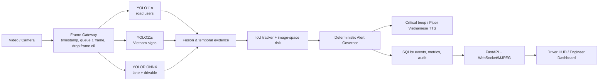

# RoadWatch Copilot — Hồ sơ bàn giao & thuyết trình

> Phiên bản MVP demo edge/offline. Đây là hệ thống **cảnh báo hỗ trợ lái (ADAS)**, không phải hệ thống tự lái và không được phép điều khiển phanh, ga hoặc vô-lăng.

## 1. Câu chuyện đề tài

**RoadWatch Copilot** giải quyết khoảng trống của camera trước thông thường: thay vì chỉ phát tiếng bíp hoặc phụ thuộc cloud, hệ thống chạy tại edge phân tích video/camera phía trước, đánh giá rủi ro theo thời gian và nói cảnh báo tiếng Việt có ngữ cảnh. Trọng tâm là giao thông Việt Nam hỗn hợp — xe máy, người đi bộ, ô tô và biển báo — với mục tiêu giúp tài xế nhận biết nguy cơ mà không gây quá tải cảnh báo.

Ví dụ đầu ra: “Xe máy phía trước bên phải, hãy giảm tốc.” Câu nói này chỉ được phát khi bằng chứng thị giác và luật ưu tiên cho phép; không phải chỉ vì một khung hình có confidence cao.

### Ràng buộc đã chốt

- Chỉ **cảnh báo/hỗ trợ**; không có API hay logic nào gửi lệnh điều khiển xe.
- Offline-first, độ trễ thấp, âm thanh là kênh chính; UI chỉ hỗ trợ quan sát.
- Giảm false positive và “alert fatigue” bằng xác nhận theo thời gian, hysteresis, cooldown và ngân sách âm thanh.
- Đo được latency, FPS, frame drop, chất lượng lane và log cảnh báo.
- Có hai vai trò: `driver` (Driver HUD) và `engineer` (Engineer Dashboard/HITL).

## 2. Những gì đã thống nhất từ đầu

### Dữ liệu và model có sẵn

| Thành phần | Tệp | Vai trò trong RoadWatch |
|---|---|---|
| Road-user detector | `models/yolo11n.pt` | Phát hiện person, bicycle, motorcycle, car, bus, truck từ COCO. |
| Vietnamese Traffic Sign detector | `models/yolo11s_vietnam_traffic.pt` | Nhận diện 82 lớp biển báo Việt Nam. |
| Lane/drivable segmentation | `models/yolop_lane_detection_640.onnx` (ưu tiên) hoặc `.pth` | Tạo lane mask và drivable-area mask. |
| Video/hình demo | `media/` | Mô phỏng camera trước; không được push lên Git nếu là dữ liệu nặng. |

Máy phát triển là Windows, AMD Ryzen 5 7535HS, RAM 16 GB, AMD Radeon RX 6550M 4 GB. Vì vậy pipeline có đường chạy DirectML/CPU. Kiến trúc cũng mở đường cho NVIDIA CUDA/TensorRT, AWS EC2 ARM64 GPU và Jetson Orin.

### Quyết định kiến trúc quan trọng

Không dùng mô tả “một shared backbone ba nhánh” vì ba model thực tế là các model độc lập. Việc khẳng định shared backbone sẽ không trung thực với artefact hiện có và khó bảo vệ trước hội đồng. Thay vào đó, RoadWatch dùng **adapter cho từng model + hợp nhất bằng chứng theo thời gian**.

Không tuyên bố khoảng cách mét hoặc TTC vật lý từ một camera đơn nếu chưa có hiệu chuẩn camera và tốc độ xe/CAN. MVP dùng **image-space risk**: kích thước/vị trí box, mức mở rộng box theo thời gian, lane/drivable evidence và lịch sử track. Đây là giới hạn an toàn có chủ đích.

SLM (nếu đưa vào sau này) chỉ được phép tóm tắt/ngôn ngữ hóa hoặc đề xuất cho kỹ sư. Nó không được thay đổi ngưỡng safety runtime và không được chặn cảnh báo critical. Bản hiện tại ưu tiên Alert Governor xác định được (deterministic).

## 3. Tại sao là “edge app có local web UI”, không phải web app cloud

Sản phẩm được xây là **ứng dụng edge chạy local**: FastAPI, models, database, âm thanh và React UI đều chạy trên thiết bị. Trình duyệt chỉ là lớp HMI/PWA tại `localhost`, nên demo rất thuận tiện nhưng khi nạp edge device/màn hình xe vẫn offline.

Điều này có ba lợi ích: không gửi video nhạy cảm lên cloud, tránh phụ thuộc mạng, và UI có thể được đóng gói kiosk/WebView sau này. UI không nằm trên đường safety-critical: nếu React treo, Alert Governor và audio vẫn có thể tiếp tục xử lý tại backend.

## 4. Luồng chạy step-to-step



1. **Nạp nguồn vào**: chọn video ở `media/` qua API hoặc camera; mỗi frame có timestamp.
2. **Frame Gateway**: queue giữ rất ngắn và bỏ frame cũ khi quá tải. Ý nghĩa: ưu tiên cảnh báo đúng thời điểm hiện tại thay vì xử lý một frame đã trễ.
3. **Perception song song theo adapter**: YOLO11n tìm tác nhân giao thông; YOLO11s tìm biển báo; YOLOP tìm lane/drivable mask.
4. **Fusion & temporal evidence**: ghép output, kiểm tra chất lượng lane và yêu cầu quan sát đủ số frame. Ý nghĩa: detector một khung hình không được trực tiếp biến thành lời cảnh báo.
5. **Tracking & risk**: tracker IoU duy trì ID; `risk.py` suy ra nguy cơ FCW, vulnerable road user, cut-in, LDW và speed-sign từ đặc trưng ảnh/lịch sử track.
6. **Alert Governor**: phân hạng severity, áp cooldown/hysteresis, chọn một cảnh báo quan trọng nhất và khóa chồng âm thanh. Critical phát beep ngay; cảnh báo khác đưa vào TTS.
7. **HMI và audit**: event/evidence/latency vào SQLite; MJPEG và WebSocket cập nhật HUD, Dashboard. Engineer có thể chỉnh ngưỡng được phép và mọi thay đổi đều audit.

## 5. Những vấn đề đã được giải quyết và vị trí trong mã nguồn

| Vấn đề | Cách RoadWatch giải quyết | Vị trí chính |
|---|---|---|
| Không phải model chung ba nhánh | Dùng adapter độc lập, fusion theo evidence. | `backend/roadwatch/perception.py`, `pipeline.py` |
| Trễ tích lũy khi máy yếu | Queue ngắn, drop frame cũ, metrics frame-drop. | `backend/roadwatch/pipeline.py`, `metrics.py` |
| GPU AMD không có CUDA | YOLOP dùng ONNX Runtime DirectML; detector có CPU fallback. | `backend/roadwatch/perception.py`, `requirements.txt` |
| False positive / alert fatigue | Temporal confirmation, track age, lane/drivable evidence, cooldown, escalation. | `tracking.py`, `risk.py`, `alerts.py` |
| TTC không đủ điều kiện khoa học | Không gán mét/TTC vật lý; dùng image-space risk minh bạch. | `backend/roadwatch/risk.py`, `docs/SAFETY.md` |
| Cảnh báo âm thanh chồng chéo | Governor độc quyền audio; beep critical ưu tiên, TTS bất đồng bộ/cache WAV. | `alerts.py`, `audio.py` |
| Tiếng Việt offline | Piper local, cache WAV; pyttsx3 là fallback. | `backend/roadwatch/audio.py`, `scripts/prepare_audio.py` |
| Phân quyền demo | Hash mật khẩu PBKDF2 + token HMAC; roles driver/engineer. | `auth.py`, `api.py`, `tests/test_auth.py` |
| HITL không làm mất an toàn | Engineer chỉ chỉnh config được whitelist, có audit; guardrails giữ giới hạn. | `api.py`, `storage.py`, `config.py` |
| HMI khác hai nhóm dùng | HUD tập trung cảnh báo tức thì; Dashboard tập trung evidence/metrics/config. | `frontend/src/` |
| Hướng VinFast nhưng tránh tuyên bố tích hợp OEM | Layout profile VF5–VF9 là baseline HMI, không phải hiệu chuẩn/safety certification. | `configs/default.json`, `docs/VINFAST_PROFILES.md` |
| Portability | Docker CPU, NVIDIA overlay, Jetson Dockerfile riêng. | `Dockerfile*`, `docker-compose*.yml` |

## 6. Cấu trúc project và cách giải thích nhanh

```text
roadwatch/
├── backend/roadwatch/       # Safety pipeline, API, auth, storage, audio
├── frontend/                # React/Vite local PWA: HUD + Engineer Console
├── configs/                 # Ngưỡng, profile HMI, nhãn biển báo
├── docs/                    # Tài liệu kiến trúc, cài đặt, an toàn, validation
├── scripts/                 # Setup, start, test, benchmark, chuẩn bị audio
├── tests/                   # Unit/API tests
├── models/                  # Model local, bị Git ignore
├── media/                   # Demo media local, bị Git ignore
└── Dockerfile*              # CPU / NVIDIA / Jetson deployment paths
```

Tài liệu tham chiếu chi tiết: `README.md`, `docs/ARCHITECTURE.md`, `docs/INSTALL.md`, `docs/SAFETY.md`, `docs/VALIDATION.md`, `docs/VINFAST_PROFILES.md`.

## 7. Cách chạy demo

Từ thư mục `roadwatch/` trên Windows PowerShell:

```powershell
.\scripts\setup.ps1
.\scripts\start.ps1
```

Mở URL mà script in ra (mặc định local). Đăng nhập:

| Vai trò | Tài khoản | Mật khẩu | Dùng để trình bày |
|---|---|---|---|
| Tài xế | `driver` | `driver123` | Driver HUD, cảnh báo trực quan/âm thanh. |
| Kỹ sư ADAS | `engineer` | `engineer123` | Metrics, event evidence, cấu hình được kiểm soát, audit. |

Quy trình demo nên dùng: login `driver` → chọn video → Start session → chỉ vào overlay object/lane, cảnh báo ưu tiên và event log → login `engineer` → mở evidence/latency và chỉnh một ngưỡng an toàn được phép → cho thấy audit trail. Dùng `test_video10.mp4` theo cấu hình mặc định vì lane geometry hoạt động tốt hơn dữ liệu demo khác.

Kiểm thử và benchmark:

```powershell
.\scripts\test.ps1
python .\scripts\benchmark.py --seconds 20
```

## 8. Bằng chứng hiện có

- Unit/API tests: **11 passed** (chỉ có warning deprecation của FastAPI TestClient).
- React production build: thành công.
- Docker compose config: hợp lệ; image CPU `roadwatch-copilot:local` đã build thành công.
- Branch Git: `roadwatch_project`; commit ứng dụng: `ec70270 Build RoadWatch edge ADAS copilot` đã push lên repository đã chỉ định.
- Benchmark AMD với `test_video10.mp4` trong 20 giây: 4.31 processed FPS, end-to-end P50 148.44 ms và P95 245.40 ms; lane quality/geometry đều đạt 1 trong mẫu test. Báo cáo cục bộ nằm ở `reports/` (bị Git ignore).
- Audio Piper Vietnamese đã kiểm tra synthesis; cache các câu báo trước được tạo local.

## 9. Giới hạn trung thực khi bảo vệ

MVP này chạy được và thể hiện pipeline ADAS end-to-end, nhưng **chưa phải sản phẩm automotive production/certified**.

- 4.31 processed FPS khi chạy đồng thời ba model trên laptop AMD hiện chưa đạt mục tiêu 30 FPS. Đây là baseline để chứng minh đo đạc được; không nên nói đã “realtime 30 FPS”.
- Bước tối ưu tiếp theo là export YOLO sang ONNX/DirectML hoặc TensorRT trên NVIDIA/Jetson, giảm tần suất sign detector, quantization và profiling lại từng model.
- Chưa có CAN speed, camera calibration, radar/LiDAR hay bộ dữ liệu đánh giá ground truth đầy đủ; vì vậy không khẳng định mét, TTC vật lý, mAP hệ thống hoặc tính năng phanh/lái.
- Profile VF5–VF9 chỉ là baseline kích thước HMI từ tài liệu công khai, không phải tích hợp ECU/CAN hay xác nhận VinFast.
- Cảnh báo có thể sai; tài xế luôn chịu trách nhiệm quan sát và điều khiển xe.

Đây là điểm mạnh về học thuật: RoadWatch nêu rõ điều kiện hiệu lực của từng cảnh báo, thay vì thổi phồng năng lực vision đơn camera.

## 10. Kế hoạch phát triển sau demo

1. Chuẩn hóa test set theo ngày/đêm/mưa/đông xe và gán nhãn scenario; ghi precision/recall theo từng loại alert.
2. Hiệu chuẩn camera và chỉ tích hợp CAN speed khi có quyền/thiết bị thật; khi đó mới đánh giá TTC vật lý.
3. Chuyển detector sang ONNX/TensorRT FP16/INT8, benchmark FPS/P50/P95 trên NVIDIA và Jetson Orin.
4. Nâng IoU tracker thành ByteTrack/Kalman nếu benchmark cho thấy lợi ích rõ rệt.
5. Tích hợp fleet telemetry/OTA theo kiểu opt-in, không gửi video thô mặc định; version model/config có rollback.
6. Làm HIL/on-road test có giám sát an toàn, không kết nối actuator trong giai đoạn nghiên cứu.

## 11. Lời giới thiệu 45 giây cho hội đồng

“RoadWatch Copilot là trợ lý cảnh báo ADAS chạy tại edge cho camera trước. Ba model độc lập nhận diện tác nhân giao thông, biển báo Việt Nam và làn đường; sau đó hệ thống hợp nhất bằng chứng qua nhiều frame, theo dõi đối tượng và tính rủi ro trong không gian ảnh. Alert Governor xác định được sẽ chỉ chọn cảnh báo cần thiết nhất, ưu tiên beep cho nguy cơ critical và giọng nói tiếng Việt offline cho cảnh báo sớm. Điểm khác biệt là RoadWatch được thiết kế để biết khi nào nên im lặng: có temporal evidence, lane/drivable validation, cooldown và audit cho kỹ sư. Nó không tự lái, không phanh, không đánh lái; toàn bộ quyết định điều khiển vẫn thuộc về tài xế.”

## 12. Git và dữ liệu

Chỉ mã nguồn `roadwatch/` được đưa lên branch `roadwatch_project`. Models, video/hình ảnh, voice cache, database/report runtime là dữ liệu nặng hoặc cục bộ và được `.gitignore` loại trừ. Khi chia sẻ cho người khác, cung cấp các file model/media qua Drive hoặc kênh riêng rồi đặt lại đúng `roadwatch/models/` và `roadwatch/media/`.

